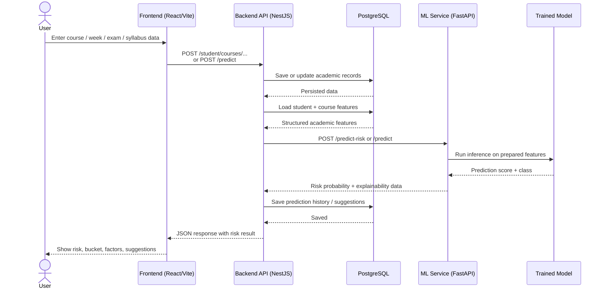
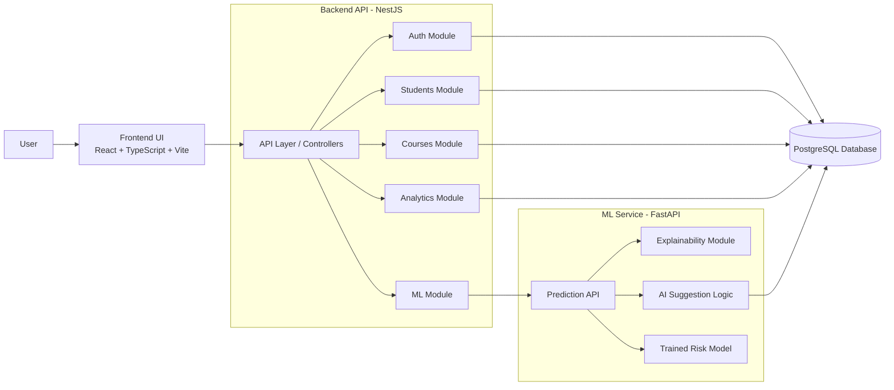
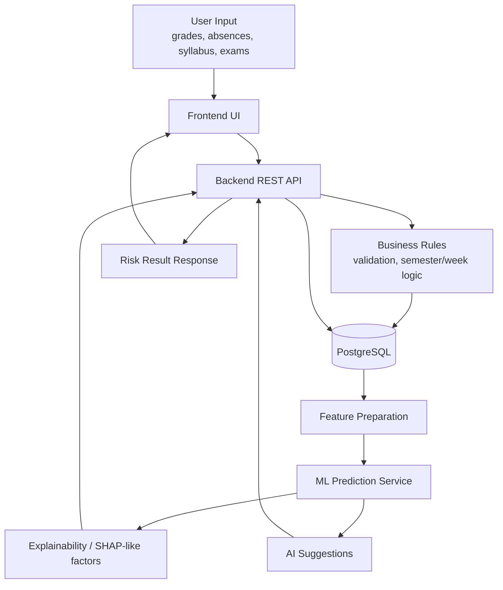

# RiskEdu Architecture Diagrams

This file contains ready-to-use Mermaid diagrams for the thesis/report.

You can:
- preview them directly in GitHub,
- open them in VS Code with a Mermaid extension,
- export them to PNG/SVG for the final document.

## 1. Sequence Diagram

This diagram shows the runtime flow when a user submits academic data and receives a risk prediction.

## 2. UML Component Diagram

This diagram shows the main software modules and their dependencies.

## 3. Data Flow Diagram (DFD)

This diagram focuses on how data travels from the interface into storage and prediction components.

## Suggested Captions For Thesis

### Figure X. Sequence diagram of prediction workflow
The sequence diagram illustrates how user-submitted academic data flows from the frontend to the backend, is persisted in the database, evaluated by the ML service, and returned to the user as a risk prediction with supporting analytical outputs.

### Figure X. UML component diagram of the RiskEdu system
The component diagram presents the modular architecture of RiskEdu, highlighting the separation between the frontend interface, backend business modules, ML inference service, and persistent storage layer.

### Figure X. Data flow diagram of the RiskEdu platform
The DFD shows how academic data is collected through the user interface, processed by backend rules and machine learning components, stored in the database, and transformed into prediction and recommendation outputs.

## Export Tips

If you need clean images for Word/PDF:
1. Open this file in GitHub or Mermaid Live Editor.
2. Render each diagram.
3. Export as `PNG` or `SVG`.
4. Use `SVG` if you want sharper print quality in the thesis.
